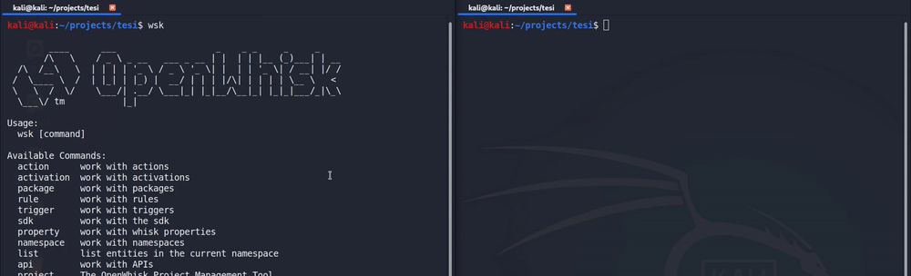

What is:
This exploit can change the code inside new python containers on Openwhisk
installations without firewalls between the invoker and the container.
Also the python containers must run the "old" actionproxy.py/pythonrunner.py
agent.

What's inside:
exploit.py : AIO script, it does the reinit unlock and script injection
racer.c: C program that does only the reinit unlock. I've included this because
it is more efficient than exploit.py
packet_request: the payload that racer.c sends to the container

example.{gif,mp4}: just a demo to show how the exploit works

Demo:

How it works:
When a new action is invoked a new container is created. In order to execute
code, the container receives two http requests: the first sends the source
code to execute (/init), the second the function arguments (/run).
Those requests are not authenticated and, if the system does not have a 
firewall (which the default installation does not provide) an attacker could
send a custom /init request before the one from the platform.

The race condition itself does not produce code execution because a container
can only handle the first request received, otherwise it raises an error
(so if the custom /init arrives first, the /init from the platform will 
cause an error)

So to obtain the code injection the custom /init must take advantage of
an exec() call inside the pythonrunner.py script. the payload (already
included in both exploits) will make the container accept every request.
This means that a second custom /init request will inject the code.

Backstory:
This exploit was proposed to the Openwhisk security team, but it was
refused because they basically assume that whoever installs openwhisk, 
will also configure a firewall (though this step is not contemplated
in the official documentation).

I don't know if they have updated the documentation or removed the 
actionproxy.py/pythonrunner.py system, but this exploit was tested on multiple
openwhisk versions (native and docker-compose) released before february 2020.

Why post a refused exploit? Because I think it's a cool vulnerability that
may be around (since the default installation of openwhisk doesn't have
a firewall between the invokers and containers) and to do a tiny show off 
for my cybersec resume.

Shield: [![CC BY-SA 4.0][cc-by-sa-shield]][cc-by-sa]

This work is licensed under a [Creative Commons Attribution-ShareAlike 4.0
International License][cc-by-sa].

[![CC BY-SA 4.0][cc-by-sa-image]][cc-by-sa]

[cc-by-sa]: http://creativecommons.org/licenses/by-sa/4.0/
[cc-by-sa-image]: https://licensebuttons.net/l/by-sa/4.0/88x31.png
[cc-by-sa-shield]: https://img.shields.io/badge/License-CC%20BY--SA%204.0-lightgrey.svg
